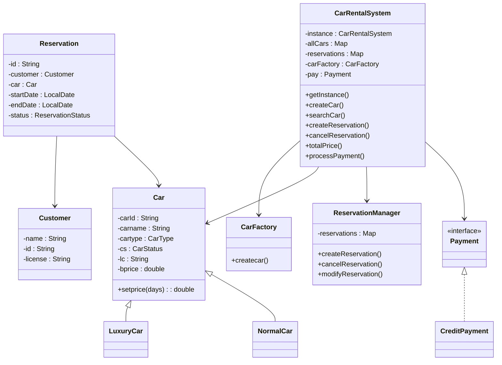

# 🚗 Car Rental System – Java OOP Project

This is a console-based Car Rental System built in Java using Object-Oriented Programming principles like Abstraction, Inheritance, Polymorphism, Encapsulation, and Design Patterns (Singleton, Factory).

---

## 📌 Project Overview

The Car Rental System allows customers to:

- Search for cars based on name/type
- View available cars
- Reserve a car for specific dates
- Modify or cancel reservations
- Process payment
- Ensure car availability across concurrent requests

It supports **concurrent reservation handling**, uses the **Singleton pattern** for system instance control, and provides a **modular, extensible architecture**.

---

## ✅ Features Implemented

| # | Feature | Status |
|---|---------|--------|
| 1 | Browse and reserve cars | ✅ |
| 2 | Store car details (make, model, year, plate, price) | ✅ |
| 3 | Search by name/type | ✅ |
| 4 | Reservation management (create, modify, cancel) | ✅ |
| 5 | Real-time availability status | ✅ |
| 6 | Customer info (name, license, contact) | ✅ |
| 7 | Payment handling | ✅ |
| 8 | Concurrent reservation handling | ✅ (thread-safe) |

---

## 🧱 Class Structure

### ➤ `Car` (Abstract)
- Fields: `carId`, `name`, `type`, `license`, `basePrice`, `status`
- Abstract method: `setPrice(days)`
- Subclasses: `LuxuryCar`, `NormalCar`

### ➤ `CarFactory`
- Factory to generate car instances based on type

### ➤ `Customer`
- Holds customer data: name, ID, license info

### ➤ `Reservation`
- Handles reservation: customer, car, dates, total price
- Status: Booked / Cancelled

### ➤ `ReservationManager`
- Maintains all reservations
- Handles creation, cancellation, modification
- Performs conflict checking based on dates

### ➤ `Payment` (Interface)
- `processPayment()`
- Implemented by `CreditPayment`, etc.

### ➤ `CarRentalSystem` (Singleton)
- Core logic for creating/searching/reserving cars
- Manages maps for cars and reservations
- Thread-safe operations with synchronization

### ➤ `Main`
- Creates test scenario
- Runs concurrent threads to simulate multiple users

---

## 📊 Class Diagram

## ⚙️ Technologies Used

- Java 17
- Object-Oriented Design
- PlantUML for class diagram
- Java's `ConcurrentHashMap` for thread-safe storage

---

## 🚀 How to Run

1. Clone the repo or copy files into your Java IDE (e.g., IntelliJ, Eclipse).
2. Make sure packages are properly set (`car`, `Customer`, `Reservation`, `Payment`, etc.)
3. Run `Main.java`.

---

## 🧪 Sample Test – Concurrent Booking

\`\`\`java
Thread t1 = new Thread(() -> {
    system.createReservation(userA, car, date1, date2);
});

Thread t2 = new Thread(() -> {
    system.createReservation(userB, car, date1, date2);
});

t1.start();
t2.start();
\`\`\`

✅ If the fix is applied, **only one reservation will succeed** for the same car.

---
